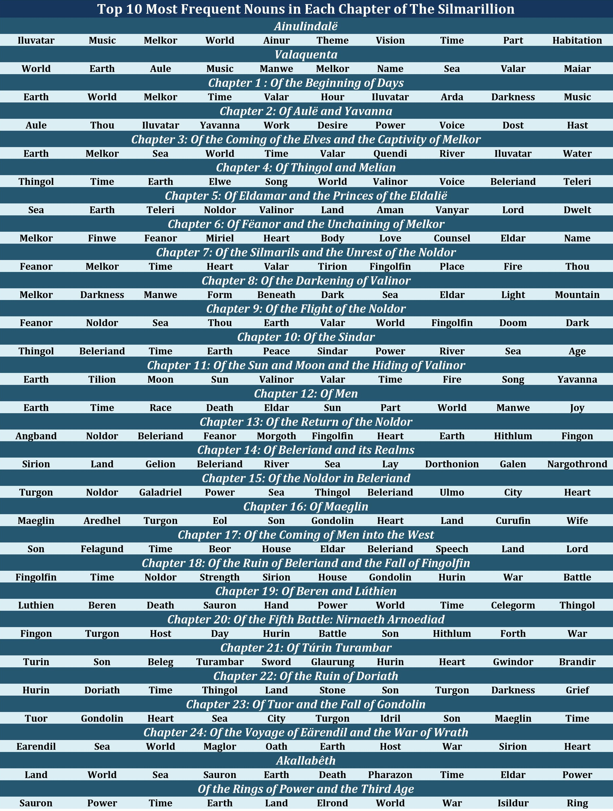

# An NLP Project on "The Silmarillion" by J.R.R. Tolkien

# 1 Introduction
## 1.1 Natural Language Processing (NLP) 
Natural Language Processing, or NLP, is within the field of linguistics and refers to a set of techniques for manipulation of natural language, such as speech and text, using software. NLP is a sub-branch of data science and has many applications, though it has been particularly useful in the healthcare industry, with the increased use of Electronic Health Records (EHR). For example, we can now predict risk for suicide and suicidal ideation by applying NLP to EHR's ([1](https://www.nature.com/articles/s41598-018-25773-2)). Companies can apply NLP to social media or product reviews, in order to understand their customers better and ultimately offer a better product or service ([2](https://www.researchgate.net/publication/309691845_A_Review_of_Natural_Language_Processing_Techniques_for_Opinion_Mining_Systems)). Since I don't have ready access to EHR's, I've decided to do this NLP project on one of my favorite books, *The Silmarillion*, by J.R.R. Tolkien. 

## 1.2 The Silmarillion
When people hear of J.R.R. Tolkien, his book *The Silmarillion* is typically not the first that comes to mind. After all, it's difficult to compete with books like *The Hobbit* and *The Lord of the Rings*, as both are far easier to read and have big budget Hollywood films tied to them. Still, *The Silmarillion* holds a special place in my heart. It lays the foundation for Middle-earth and sets the stage for the more popular books in Tolkien's catalogue. The book is incredibly dense, content-wise, and written in a formal and archaic style, more similar to the Bible than *The Lord of the Rings*. It's challenging and some find it impenetrable. Though, I can't recommend it more to fans of fantasy and for Tolkien fans, it's simply essential reading. 

Having read both *The Hobbit* and *The Lord of the Rings* at a very early age, I admit to having avoided *The Silmarillion* until about 10 years ago. I was part of a seminar of about 30 other geeks who met online bi-weekly to discuss each chapter in detail. The seminar was later released as a podcast ([3](https://tolkienprofessor.com/lectures/courses/silmarillion-seminar/))([4](https://itunes.apple.com/us/course/the-silmarillion-seminar/id599723153)), and for anyone planning to read the book....maybe it will help!

# 2 Data
The full text of *The Silmarillion* used in this project is accessible here ([5](https://archive.org/stream/fegmcfeggerson_gmail_4731/473%20%281%29_djvu.txt)). After scraping the webpage and cleaning the text, I extracted the entire text and the text for each separate chapter and created a PANDAS dataframe. I then used the modules NLTK and Text Blob to extract some basic information from the text and then the modules Text Blob, VADER, and the NRC Emotion Lexicon to perform sentiment analyses by chapter. All values for sentiment analyses and descriptive text analyses were added to the dataframe, pictured below.

# 3 Text Analyses
## 3.1 Word Cloud 
Using the Natural Language Toolkit module (NLTK)([6](https://www.nltk.org/)), I first "tokenized" each word from the book, extracting each "token" and removing all whitespace, punctuation, etc. Then, I made all tokens lower-case for consistency and removed "stop-words." Stopwords are referred to as the words in a text that don't particularly convey significant meaning, such as "the", "in", and "a". Finally, I got the frequency of each word, or toke, and then created a "word cloud" of the most frequently used words superimposed over a shield (much easier than to superimpose over a sword!).

## 3.2 Most Frequent Nouns
Again, using NLTK, I conducted the same preliminary text manipulation as above (tokenize, lower-case, and stopwords) on each separate chapter. Following this, I used NLTK to tag the different parts of speech for each word. This tags each word in the text with its part of speech, for example "NN" for noun and "VB" for verb. The top 10 most frequent nouns were extracted for each chapter and appear on the table below. This helps give a sense of what each chapter is about. For example, the *Ainulindalë* is a Creation story of the origin of the universe. The Ainur are spiritual beings, akin to angels, who sing a vision of the universe into existence based on a theme given to them by Iluvatar (God). Melkor is one of the Ainur and the most powerful and knowledgeable of them all. He broke from the harmony and developed his own song, causing discord in the overall theme. After some struggle, Iluvatar stopped the music and showed them the world they had created which was before just a vision. As you can see, the top 10 nouns for this chapter strongly reflect the summary just given.

## 3.3 Lexical Density
Lexical density is formally defined as the number of lexical words (or content words) divided by the total number of words in a text. Lexical words give a text its meaning and provide information regarding what the text is about (nouns, adjectives, verbs, and adverbs). Other words such as articles (a, the), prepositions (on, at, in), conjunctions (and, or, but), and so forth are more grammatical in nature and, by themselves, give little or no information about what a text is about. With the above in mind, lexical density is simply the percentage of words in a text that offer information about what is being communicated. Lexical density is simply a measure of how informative a text is. 

Because this score is sensitive to total word count, I included both the normal scores for each chapter in addition to the "normalized" scores. The "normalized" scores were attained by only using the first 3440 words in each chapter, as this is the word count for the shortest chapter. Because of this sensitivity to word count, it is difficult to compare one text to another, but by using "normalized" scores, we can compare chapters to a reasonable degree. The range of scores is 0 to 1 (0-100%), with higher scores indicating higher lexical density. The scores did not change much between the two methods and the average across all chapters was around 0.25 (*SD* = 0.06) for the normal method and 0.27 (*SD* = 0.04) for the "normalized" method. 

# 4 Sentiment Analyses
Sentiment analysis is a method of contextual mining of text, or unstructured data, that identifies and extracts subjective information from that source, whether it be a book, tweets, movie and product reviews, or electronic health records. Sentiment analysis is the process of determining the attitude or emotion of the writer. 

## 4.1 TextBlob
[TextBlob](https://textblob.readthedocs.io/en/dev/quickstart.html) is a Python library for processing textual data and helps with tasks such as part-of-speech tagging, noun phrase extraction, sentiment analysis, and more. The sentiment function of TextBlob produces two properties: *polarity* and *subjectivity*. Polarity is a number [-1, 1] where 1 refers to a positive statement and -1 refers to a negative statement. Subjectivity is a number [0, 1] where a 0 refers to an objective statement and 1 refers to a subjective statement. Subjective sentences generally refer to personal opinions, emotions or judgments and objective refers to factual information. In the graph below, we see that the Subjectivity score is typically around 0.4, give or take, indicating the text is generally more objective than subjective. This makes sense as the book is closer to a historical account, rather than a subjective narrative. The Polarity score across chapters is pretty low between 0.0-0.2, but never drops into the negative range. This is surprising for anyone who has read chapters like *Of the Darkening of Valinor* and *Of Turin Turambar*, though it is reassuring to see that those are some of the lowest points on the line. 

|               | Mean          | SD    |  Min   |   Max  |
| ------------- |:-------------:| -----:| ------:| ------:|
| *Polarity*    | 0.11          | 0.06  | 0.003  | 0.214  |
| *Subjectivity*| 0.41          | 0.05  | 0.338  | 0.507  |

## 4.2 VADER
[VADER](https://github.com/cjhutto/vaderSentiment) (Valence Aware Dictionary and sEntiment Reasoner) is a sentiment analysis tool that is specifically designed to examine sentiments expressed in social media. This lexicon is sensitive to both the *polarity* and the *intensity* of sentiments expressed in social media contexts, and is also generally applicable to other forms of text. Because VADER was specifically designed for use with short pieces of text on social media, I decided to loop the analyses through each sentence of a chapter and then to get the average over all sentences for a total sentiment score for that particular chapter. 

Seen below are the full results from the VADER analysis. You can see right away that the *Neutral* sentiment score is quite high across all chapters. This is likely due to the style of writing in *The Silmarillion*, which is quite formal and impartial. As an example, consider this passage from the chapter with the highest *Negative* rating (*Of the Darkening of Valinor*): *"In a ravine she lived, and took shape as a spider of monstrous form, weaving her black webs in a cleft of the mountains. There she sucked up all light that she could find, and spun it forth again in dark nets of strangling gloom, until no light more could come to her abode; and she was famished*." This passage paints quite a gloomy scene, but it's written in such a formal and matter of fact way, as is the book in general. Now imagine an account of the same monstrous light-eating spider in the form of a personal narrative by a character witnessing it all...I expect the *Neutral* score would be far lower!

|               | Mean          |  SD   |  Min   |   Max  |
| ------------- |:-------------:| -----:| ------:| ------:|
| *Positive*    | 0.08          | 0.02  | 0.051  | 0.131  |
| *Negative*    | 0.07          | 0.02  | 0.020  | 0.098  |
| *Neutral*     | 0.86          | 0.02  | 0.813  | 0.910  |
| *Compound*    | 0.05          | 0.11  | -0.136 | 0.251  |

Now, let's look at the same graph without the *Neutral* line and zoomed in to the rest. The graph shows the *Positive* sentiment is higher than the *Negative* at first, then they both tend to overlap a bit in the middle before *Negative* increases and remains over *Positive* until both essentially converge at the very end of the book. The *Composite* score shows a general negative linear trend throughout the book, with a slight rally at the end. The results seem fairly accurate. For example, consider the surge in the *Composite* score at *Of the Coming of the Elves and the Captivity of Melkor* and then the sudden drop after *Of Feanor and the Unchaining of Melkor*, which continues until the books lowest point during *Of the Darkening of Valinor*. If you've read the book, you know that Melkor is the major antagonist and, as a sort of fallen angel figure, is the source of all the misery throughout. 

Here is another visualization of only the *Composite* score with added rankings of *Positive* (>.05), *Negative* (-.05 to .05), and *Neutral* (<.05) for each chapter. 

## 4.3 NRC Word-Emotion Association Lexicon
The [NRC Emotion Lexicon](https://saifmohammad.com/WebPages/NRC-Emotion-Lexicon.htm) is a list of English words and their associations with eight basic emotions (anger, fear, anticipation, trust, surprise, sadness, joy, and disgust) and two sentiments (negative and positive). The selection of emotions were based on the work of Robert Plutchik, a psychologist and professor who considered these to be the eight primary emotions, combinations of which led to more complex emotions (i.e. *Joy + Trust = Love*). In the graphs below, I've included each basic emotion with what Plutchik considered to be its opposite emotion (i.e. *Anger/Fear*). The table below indicates that the text, in general, shows a higher *Positive* rating than *Negative*. The strongest emotions across all chapters seem to be *Trust*, *Anticipation*, and *Fear*. The weakest emotions are *Surprise* and *Disgust*.

|               | Mean          |  SD   |  Min   |   Max  |
| ------------- |:-------------:| -----:| ------:| ------:|
| *Positive*    | 0.040         | 0.008 | 0.027  | 0.059  |
| *Negative*    | 0.029         | 0.008 | 0.009  | 0.042  |
| *Anger*       | 0.013         | 0.004 | 0.006  | 0.019  |
| *Fear*        | 0.018         | 0.007 | 0.001  | 0.034  |
| *Joy*         | 0.015         | 0.005 | 0.008  | 0.026  |
| *Sadness*     | 0.016         | 0.005 | 0.005  | 0.027  |
| *Surprise*    | 0.007         | 0.002 | 0.003  | 0.012  |
| *Anticipation*| 0.022         | 0.004 | 0.013  | 0.030  |
| *Trust*       | 0.022         | 0.004 | 0.013  | 0.028  |
| *Disgust*     | 0.008         | 0.003 | 0.002  | 0.015  |

In the graph below, we can see that the results mirror the results from the two previous tools, for the most part. Generally, the book shows a higher *Positive* rating, aside from two major points, where the *Negative* rating shoots upward and the *Positive* drops considerably. This happens between *Of the Silmarils and the Unrest of the Noldor* and *Of the Flight of the Noldor* and again between *Of the Ruin of Beleriand and the Fall of Fingolfin* and *Of the Ruin of Doriath*. Those who have read the book know, but even if you haven't, just read the chapter titles and it becomes apparent that these weren't good times..."flight", "unrest", "ruin", "fall".

In the *Anger/Fear* graph, we see both emotions follow a similar trend, though the *Fear* shows some stronger spikes. This is particularly evident during *Of the Ruin of Beleriand and the Fall of Fingolfin* and *Of Turin Turambar*. These are fearful chapters. During the former, Fingolfin, one of the most powerful Elves, dies during physical combat with Morgoth (AKA, Melkor) and would have had his broken body fed to his wolves if Thorondor, the King of the Eagles, hadn't swooped down and taken him away. In the latter, Turin is a tragic cursed hero who basically has every bad thing happen to him...ever. Turin is basically the embodiment of Murphy's law.   

In the *Joy/Sadness* graph, we see the emotions tend to travel in opposite paths, but not always. Generally, there is a slight positive trend in *Sadness* and a negative trend in *Joy* throughout the book, meaning that *Sadness* tends to increase over the chapters, while *Joy* tends to decrease. The point with the lowest *Joy* and highest *Sadness* seems to be during *The Darkening of Valinor* and the point of highest *Joy* and lowest *Sadness* seems to be during *Of Thingol and Melian*. 

In contrast with the first two graphs, the graph below shows two emotions that do not cross paths. *Anticipation* rates higher than *Surprise* consistently throughout the entire book. *Surprise* yields the lowest average score of all the emotions measured and also has a fairly low range in scores. *Anticipation* is highest during *Of Men*, which makes sense. This is a chapter that covers the creation of Man by Iluvatar, discusses their fate compared with that of the Elves, and mentions the eventual fading power of the Elves and how Men "usurped the sunlight." 

Similar to the preceding graph, the *Trust/Disgust* graph reveals no overlap between the emotions. *Trust* is considerably higher than *Disgust* throughout. During *Of the Darkening of Valinor*, the two emotions come closest where *Trust* is lowest. Remember this is the chapter with the "monstrous light-eating spider", but more than that, it's a pivotal point in the book where Morgoth basically puts an end to the relative bliss previously experienced by the Valar and the Elves. 

# 5 Conclusion
Across these different sentiment analyses, we can see a general consensus that *negativity* tends to increase throughout the book and *positivity* tends to decrease. There were two points throughout the analyses that revealed emotional extremes in the book. The first was during *Of Thingol and Melian* and the second was during *Of the Darkening of Valinor*. These likely seem reasonable extremes to those who have read the book. For those who haven't, consider the emotional differences in the following short passages from each chapter:
______________________________________

**Of Thingol and Melian**:

"*Elwe, lord of the Teleri, went often through the great woods to seek out Finwe his friend in the dwellings of the Noldor; and it chanced on a time that he came alone to the starlit wood of Nan Elmoth, and there suddenly he heard the song of nightingales. Then an enchantment fell on him, and he stood still; and afar off beyond the voices of the lomelindi he heard the voice of Melian, and it filled all his heart with wonder and desire. He forgot then utterly all his people and all the purposes of his mind, and following the birds under the shadow of the trees he passed deep into Nan Elmoth and was lost. But he came at last to a glade open to the stars, and there Melian stood; and out of the darkness he looked at her, and the light of Aman was in her face. She spoke no word; but being filled with love Elwe came to her and took her hand, and straightway a spell was laid on him, so that they stood thus while long years were measured by the wheeling stars above them; and the trees of Nan Elmoth grew tall and dark before they spoke any word.*" 

**Of the Darkening of Valinor**:

"*And in that very hour Melkor and Ungoliant came hastening over the fields of Valinor, as the shadow of a black cloud upon the wind
fleets over the sunlit earth; and they came before the green mound Ezellohar. Then the Unlight of Ungoliant rose up even to the roots of the Trees, and Melkor sprang upon the mound; and with his black spear he smote each Tree to its core, wounded them deep, and their sap poured forth as it were their blood, and was spilled upon the ground. But Ungoliant sucked it up, and going then from Tree to Tree she set her black beak to their wounds, till they were drained; and the poison of Death that was in her went into their tissues and withered them, root, branch, and leaf; and they died. And still she thirsted, and going to the Wells of Varda she drank them dry; but Ungoliant belched forth black vapours as she drank, and swelled to a shape so vast and hideous that Melkor was afraid.*"
______________________________________

The stark contrast in emotional content of these two chapters is obvious to any human reader, but isn't it amazing that with some guidance, a machine can come to the same conclusion. I think this effectively demonstrates the power of NLP in working with unstructured data. This type of text data is ubiquitous, whether found in a text like *The Silmarillion* or with social media posts, emails, product reviews, and electronic health records. 

If you haven't read *The Silmarillion* and this report has piqued your interest...[go for it](https://www.amazon.com/Silmarillion-J-R-Tolkien-2013-08-01/dp/B01N2GB9TY/ref=sr_1_2?keywords=silmarillion&qid=1570414529&sr=8-2)! And remember to check out the [podcast](https://itunes.apple.com/us/course/the-silmarillion-seminar/id599723153) I mentioned at the start. I haven't listened to it in years because I hate the sound of my recorded voice, but for others I'm sure it can offer some solid commentary! 

I'll likely follow this with similar analyses of *The Hobbit* and *The Lord of the Rings*, so if you're into it, stay tuned...
